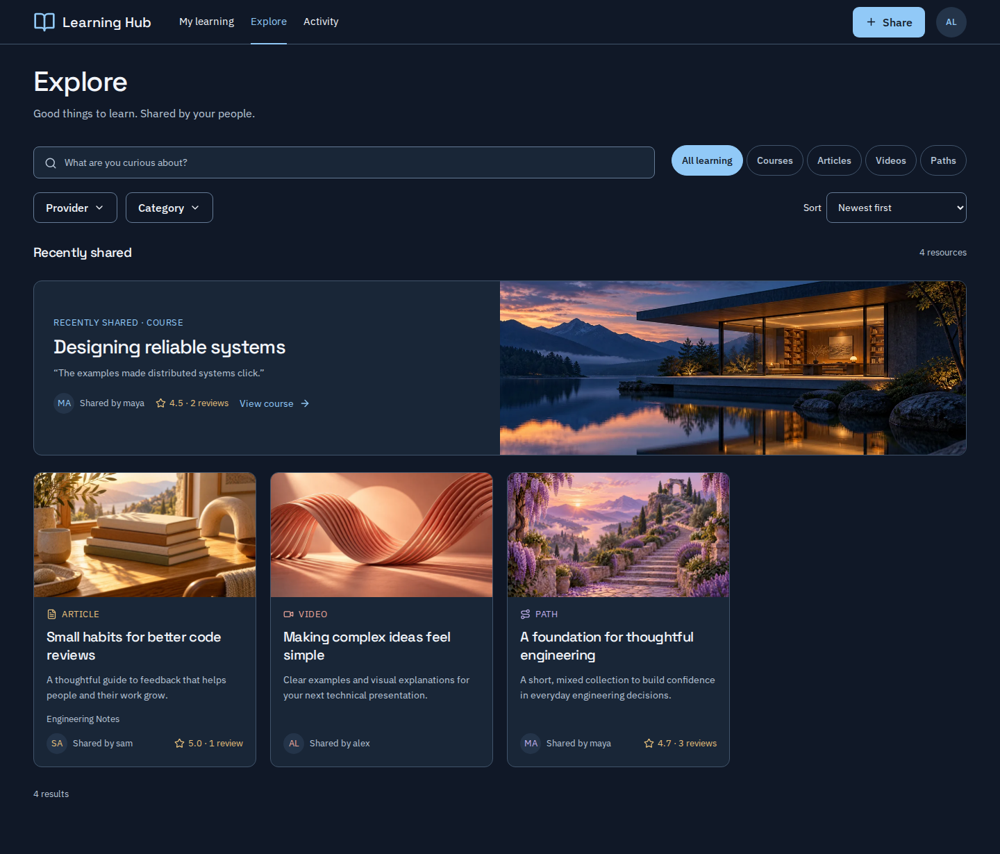
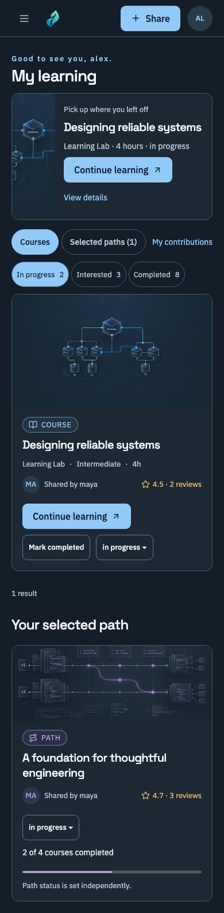

# Upstream

**A shared learning library for your team.**

Upstream gives people one place to save and share useful online courses, videos and articles, and organise them into learning paths. Each contribution becomes part of an internal library that everyone in the organisation can discover and learn from.

Found an article that helped you solve a problem, a video that explained something clearly, or a course worth taking? Save its link, add why you recommend it, and pass it on. Colleagues can find those recommendations later, share their own reviews, and combine resources into paths that help others get started with a subject.

The library grows as people share what they learn. Resources stay on their original websites; Upstream brings the links, recommendations and learning paths together.

*Share what you learn.*

*Explore the shared library. Screenshots use fictional content from the mocked browser suite.*

- **Explore:** discover courses, articles, videos, and mixed learning paths.
- **My learning:** continue a course, track course progress, and manage selected paths.
- **Activity:** personal statistics, reviews on your content, and shared-content updates.
- **Share:** save links for colleagues with an optional “Why I recommend this” note, or assemble resources into a learning path.
- **Admin:** manage accounts and access.

Mobile preview — My learning

Continue a course, track progress and manage selected paths on a smaller screen.

See the [brand identity](docs/branding/README.md) and [artwork guidance](docs/artwork/README.md) for the design details.

Courses support progress tracking. Articles and videos support reviews; they do not have completion tracking. Path status is manual and independent of the displayed course-completion count. Content is globally shared; personal progress is private except for authorized administrative access.

## Requirements

Upstream uses a React frontend, a FastAPI backend and PostgreSQL.

Python 3.13, uv, Node.js 22.13 or later, npm, and Docker Compose. `just` is optional.

## Run with Docker

1. Copy `.env.example` to `.env`.
2. Set `POSTGRES_PASSWORD`, `BOOTSTRAP_ADMIN_PASSWORD`, and `BROWSER_SECRET` to unique values. Use a URL-safe database password (letters, digits, hyphens, and underscores) because Compose embeds it in the connection URL. Generate a browser secret with `python3 -c "import secrets; print(secrets.token_urlsafe(48))"`.
3. Run `docker compose up --build`.
4. Open `http://localhost:8080`; API documentation is at `http://localhost:8080/api/docs`.

The one-shot migration service applies additive migrations before the API starts. Nginx serves React and proxies `/api` on the same origin. Existing PostgreSQL volumes retain their data; changing an environment password does not change an existing database user's password.

For source watching: `docker compose -f docker-compose.yml -f docker-compose.watch.yml up --watch`.

## Local development

1. Configure `.env` as above, including `DATABASE_URL`.
2. Install dependencies: `uv sync --group dev` and `npm ci --prefix frontend/react`.
3. Start PostgreSQL: `docker compose up -d postgres`.
4. Export `.env` variables into your shell, then run `uv run alembic upgrade head`.
5. Start the backend: `uv run uvicorn backend.main:app --reload --port 8000`.
6. Start React in another terminal: `npm run dev --prefix frontend/react`.

Vite proxies `/api` to `http://127.0.0.1:8000`; `BACKEND_URL` overrides this development target. The UI is at `http://127.0.0.1:5173`. Local browser origins are allowed only on localhost/127.0.0.1. Development cookies do not require HTTPS.

## Checks and further guidance

Use a disposable PostgreSQL database for tests: backend fixtures truncate tables.
Run `just test` and `just build-ui` for backend/frontend checks, or `just check` to include contract and pinned Linux visual checks. Database tests require an explicit disposable database; see [operations](docs/operations.md#tests-and-quality-checks). Live browser checks use `just e2e` with a separately prepared test database.

- [Product guide](docs/product.md): capabilities, pagination and visibility.
- [Documentation index](docs/README.md): current guidance, implementation history, and approved designs.
- [Operations and verification](docs/operations.md): commands, contracts, browser/visual checks, deployment, and rollback.
- [Architecture](docs/architecture.md) and [engineering standards](AGENTS.md).

New-resource forms support optional **Fetch details** from page-authored metadata. Artwork is bundled locally: ten covers per resource type. Draft recovery and personal course tracking remain independent of metadata fetching.

Docker uses port **8080** by default. After changing source, rebuild images; restarting an old image does not update the UI.
