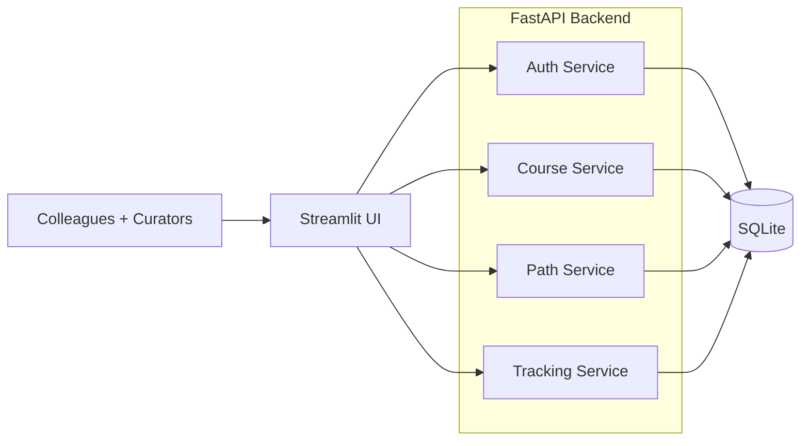

# Architecture

## Overview
This project uses a simple three‑tier layout:

- Streamlit UI for the colleague‑facing web experience.
- FastAPI backend for auth, course management, learning paths, and tracking.
- SQLite for persistence (seeded from `courses.csv` on startup).

## Mermaid diagram

## Service responsibilities (brief)

### Auth service
- Email allow‑list role detection (admin vs user).
- Role enforcement for admin‑only endpoints.

### Course service
- CRUD for courses (title, provider, category, level, duration, url).
- Search and filtering support.

### Path service
- CRUD for learning paths.
- Attach courses to paths (no ordering yet).

### Tracking service
- Track per‑colleague progress (interested / in_progress / completed).
- Aggregate stats (team vs individual).
