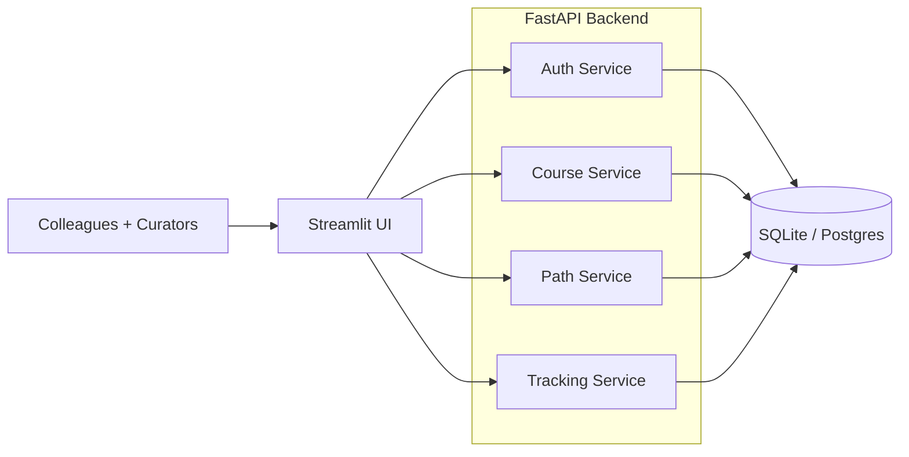

# Architecture

## Overview
This project uses a simple three-tier layout:

- Streamlit UI for the colleague-facing web experience.
- FastAPI backend for auth, course management, learning paths, and tracking.
- SQLite (local) or Postgres (hosted) for persistence.

## Mermaid diagram

## Service responsibilities (brief)

### Auth service
- User login and basic role checks (curator vs colleague).
- Session management for the Streamlit UI.

### Course service
- CRUD for courses (title, provider, category, level, duration, url).
- Search and filtering support.

### Path service
- CRUD for learning paths.
- Attach courses to paths with ordering.

### Tracking service
- Track per‑colleague progress (interested/completed).
- Aggregate stats (popular courses, completion rate).
