# Architecture

## Overview
This project uses a simple three‑tier layout:

- Streamlit UI for the colleague‑facing web experience.
- FastAPI backend for auth, course management, learning paths, and tracking.
- SQLite for persistence (seeded from `courses.csv` on startup).

## Mermaid diagram

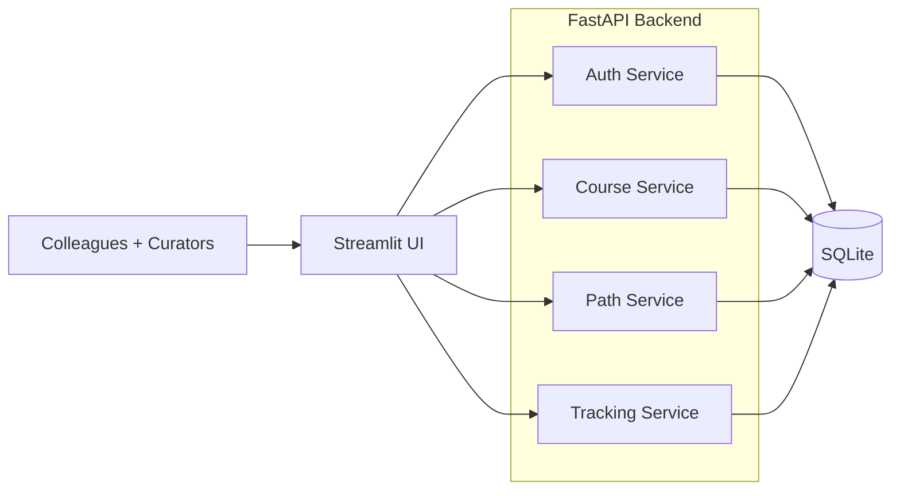

## Auth Architecture

### Auth Sequence

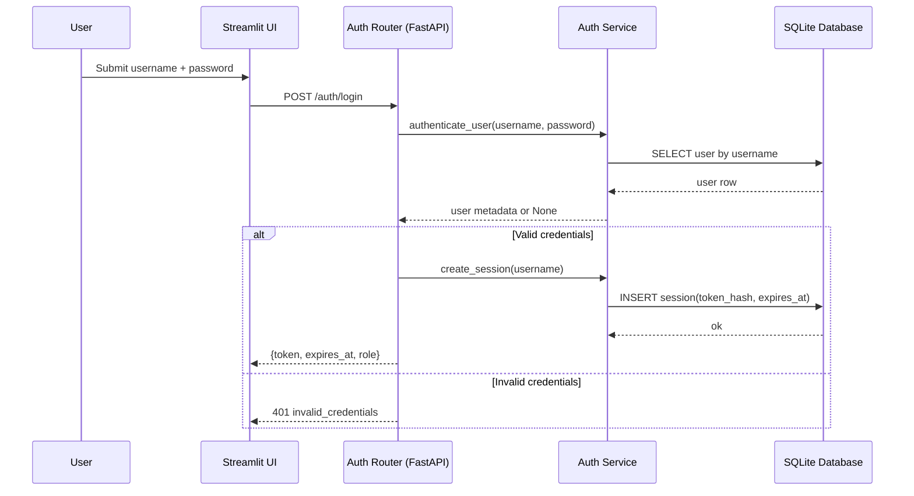

### Auth Domain Overview

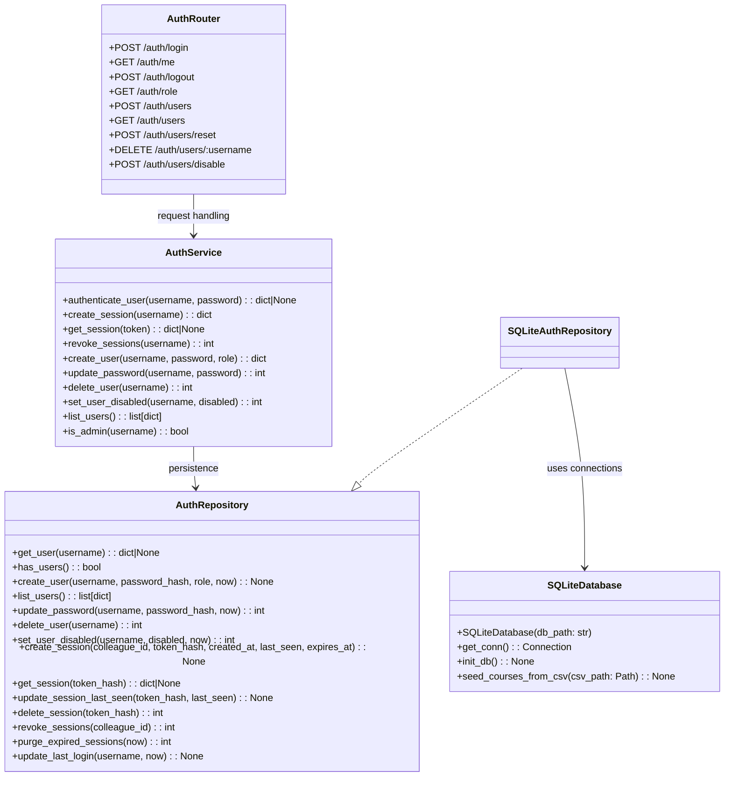

### Auth Data Model

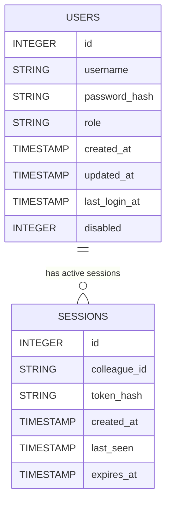

## Service responsibilities (brief)

### Auth service
- Bootstrap admin creation when no users exist.
- Username/password authentication with bcrypt.
- Session creation, validation, and revocation.
- Admin-only user management (create, reset, disable, delete, list).

### Course service
- CRUD for courses (title, provider, category, level, duration, url).
- Search and filter by query/provider/category/level.
- Admin-only create/update/delete.

### Path service
- CRUD for learning paths with ordered course lists.
- User path selection, unselection, and status updates.
- Admin-only create/update/delete for paths.

### Tracking service
- Track per-user course progress (interested / in_progress / completed).
- Recent activity and stats (per-user and team).
- Admin-only team-wide stats.

## Courses Architecture

### Courses Sequence

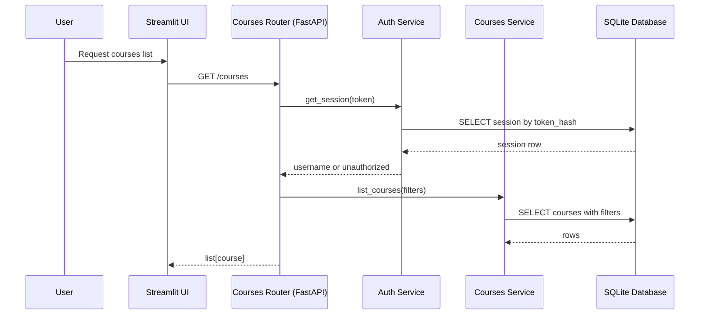

### Courses Domain Overview

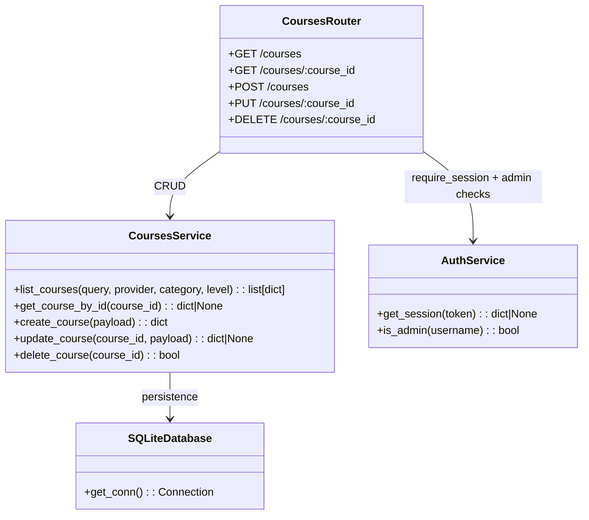

### Courses Data Model

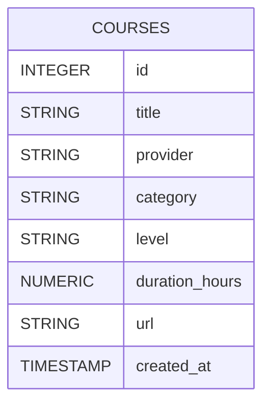

## Paths Architecture

### Paths Sequence

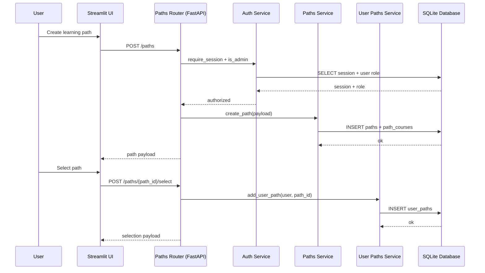

### Paths Domain Overview

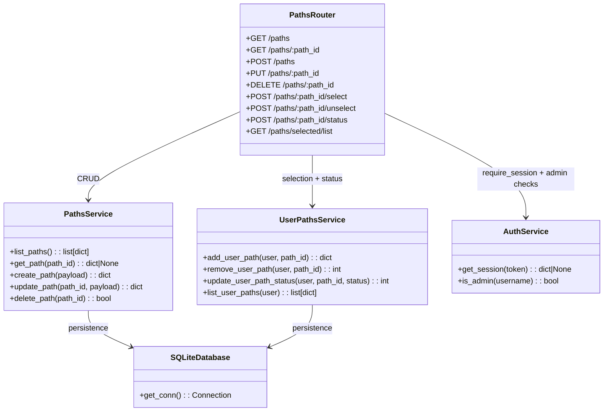

### Paths Data Model

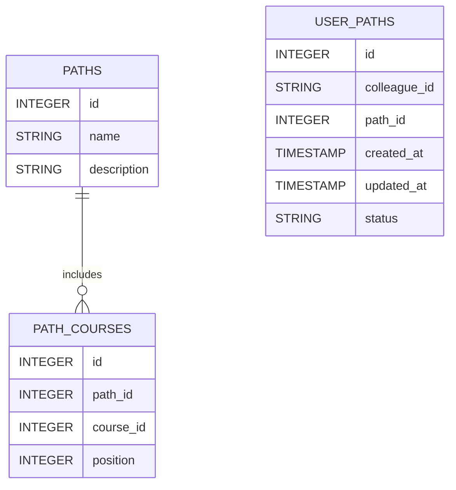

## Tracking Architecture

### Tracking Sequence

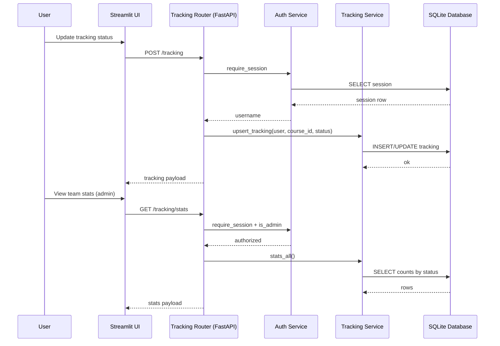

### Tracking Domain Overview

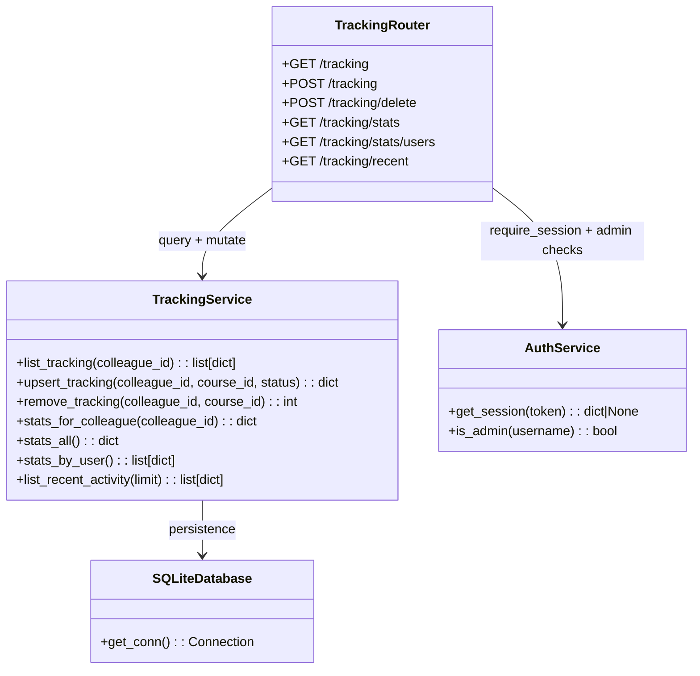

### Tracking Data Model

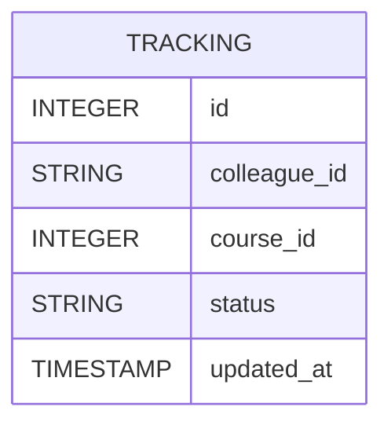
