# Backend Architecture

## Overview
The backend is a FastAPI application organized as:

- Routers (HTTP endpoints).
- Dependencies (request-scoped construction + auth guards).
- Services (domain logic).
- Repositories (persistence).
- Postgres (schema managed via Alembic).

The backend also includes an observability layer:
- OpenTelemetry traces + metrics initialization at app startup.
- Authenticated frontend product-event ingestion via `POST /telemetry/events`.
- OTLP export to an OpenTelemetry Collector (fan-out to Tempo/Prometheus).
- Logs shipped by Promtail into Loki for Grafana log exploration.

## High-Level Diagram

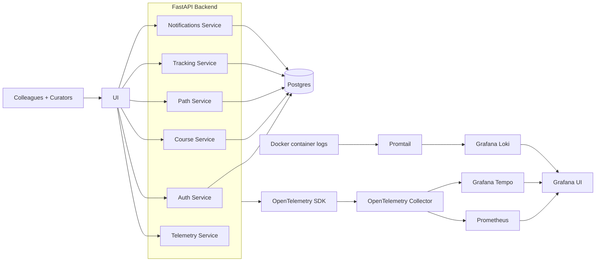

## Observability Architecture

### Runtime wiring
- `backend/main.py` initializes observability with `configure_observability(app)` when `OTEL_ENABLED=1`.
- `backend/core/observability.py` configures:
  - Tracer provider + OTLP trace exporter.
  - Meter provider + OTLP metrics exporter.
  - FastAPI / HTTPX / SQLAlchemy instrumentation.

### Telemetry ingestion flow
- Frontend emits product events to `POST /telemetry/events` (authenticated).
- Router: `backend/api/telemetry.py`
- Service: `backend/services/telemetry_service.py`
- Current behavior:
  - Increments metric counter `frontend_events_total`.
  - Emits span `frontend.event` with event attributes.
  - Logs a structured fallback line for operational debugging.

### Key environment settings
- `OTEL_ENABLED`
- `OTEL_SERVICE_NAME`
- `OTEL_SERVICE_VERSION`
- `OTEL_DEPLOYMENT_ENVIRONMENT`
- `OTEL_TRACES_SAMPLE_RATIO`
- `OTEL_EXPORTER_OTLP_TRACES_ENDPOINT`
- `OTEL_EXPORTER_OTLP_METRICS_ENDPOINT`
- `OTEL_EXPORTER_OTLP_HEADERS`

### Local Grafana stack wiring
- Observability stack runs separately via `docker-compose.observability.yml`.
- Collector exports traces to Tempo (`TEMPO_OTLP_ENDPOINT`, default `http://tempo:4318/v1/traces`).
- Collector exports metrics in Prometheus format on `:9464`; Prometheus scrapes Collector.
- Promtail discovers Docker containers and ships logs to Loki.
- Grafana is configured with provisioned datasources for:
  - Prometheus (`http://prometheus:9090`)
  - Tempo (`http://tempo:3200`)
  - Loki (`http://loki:3100`)

## Auth Architecture

### Auth Sequence

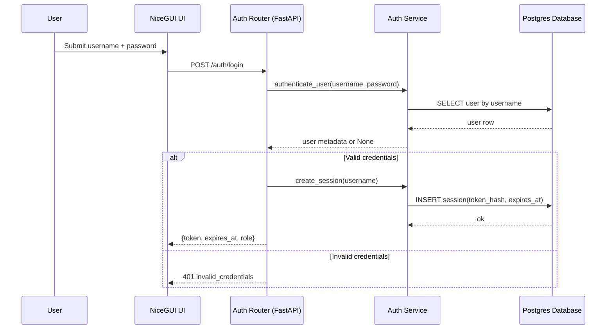

### Auth Domain Overview

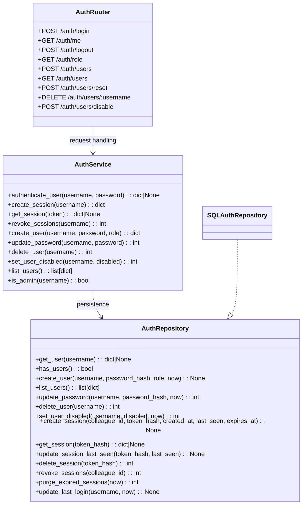

### Auth Data Model

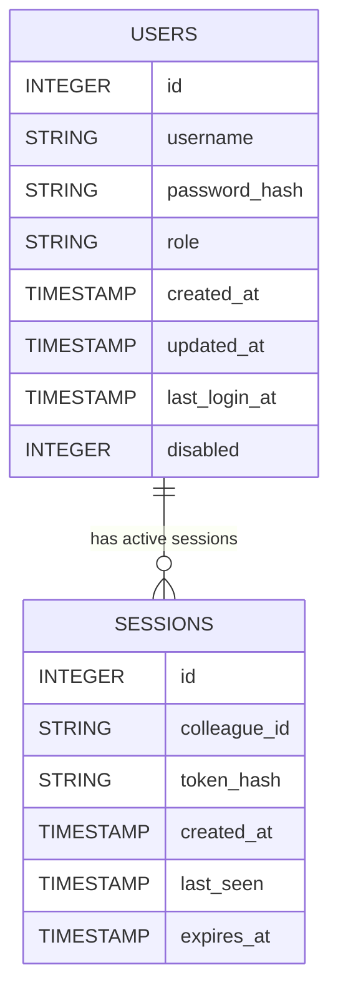

## Service Responsibilities (Brief)

### Auth service
- Bootstrap admin creation when no users exist.
- Username/password authentication with bcrypt.
- Session creation, validation, and revocation.
- Admin-only user management (create, reset, disable, delete, list).

### Course service
- CRUD for courses (`title`, `description`, `learning_outcomes`, `prerequisites`, `language`, `provider`, `category`, `level`, `duration_hours`, `url`).
- Search and filter by query/provider/category/level.
- Any authenticated user can create courses; only the creator (or admin) can edit/delete.
- Validates create/update payloads at the service boundary via typed `_parse_mutation_payload`.
- Enriches course payloads with computed `search_document` content and best-effort URL preview image URLs.
- Enforces duplicate protection on create (`url`, normalized title+provider).

### Path service
- CRUD for learning paths with ordered course lists.
- User path selection, unselection, and status updates.
- Any authenticated user can create paths; only the creator (or admin) can edit/delete.

### Tracking service
- Track per-user course progress (interested / in_progress / completed).
- Recent activity and stats with explicit auth rules:
  - `GET /tracking?colleague_id=X`: self always allowed, other users require admin.
  - `GET /tracking/stats?colleague_id=X`: self always allowed, other users require admin.
  - `GET /tracking/stats` without `colleague_id`: team totals, admin only.
  - `GET /tracking/stats/users` and `GET /tracking/recent`: admin only.

### Articles service
- Allow colleagues to share links (title, URL, optional tags).
- Browse/search colleague-submitted links.
- Authenticated users can create articles and review article links.

### Videos service
- Allow colleagues to share video links as first-class learning items (`title`, `description`, `provider`, `category`, `url`).
- Browse/search colleague-submitted videos with preview metadata enrichment.
- Authenticated users can create videos; the current phase keeps videos lightweight and does not add tracking/recommendation/review write models.

### Notifications service
- Aggregates share/recommend/review events into activity feed payloads.
- Supports mailbox-style scopes: `inbox` (personal) and `team` (team-wide timeline).

### Telemetry service
- Accepts low-risk frontend product telemetry events (`event_name`, optional context, timestamp).
- Records event count + tracing attributes for product-loop analysis and operability.
- Keeps ingestion auth-protected via `require_session`.

## API Error Handling

Service-layer failures are represented by domain-specific `ServiceError` exceptions (for example `AuthServiceError`, `CoursesServiceError`, `PathsServiceError`, `UserPathsServiceError`, `TrackingServiceError`). The FastAPI app registers exception handlers that convert these into a standard JSON payload:

```json
{
  "status": "error",
  "message": "missing_title",
  "timestamp": "2026-02-07T12:34:56.789012+00:00"
}
```

Endpoints still use `HTTPException` directly for request/permission semantics (for example `401 unauthorized`, `403 admin_required`, `404 not_found`).

## Request Validation

Each router defines Pydantic request and response schemas. Invalid request payloads (wrong types, missing required fields, invalid list element types) are rejected with `422 Unprocessable Entity` before service methods run.

## Service Input Boundary

Services must parse externally influenced inputs at the service boundary using typed Pydantic dataclass `_parse_*` helpers.

Required contract:
- Each service entrypoint that accepts request/user-provided values calls a local `_parse_*` helper before business logic.
- Each `_parse_*` helper catches `ValidationError` and raises the domain `*ServiceError` with:
  - `detail="invalid_payload"`
  - `status_code=400`

This keeps router-level schema validation and service-level domain validation aligned, and provides deterministic error semantics for tests and clients.

### Service Payload Boundary Matrix

This matrix is the enforceable contract for service-boundary input parsing.

| Service file | Entrypoints covered | Parse helpers | Guard test |
| --- | --- | --- | --- |
| `backend/services/auth_service.py` | `is_admin`, `create_session`, `get_session`, `revoke_sessions`, `get_user`, `create_user`, `update_password`, `delete_user`, `authenticate_user`, `set_user_disabled` | `_parse_username_payload`, `_parse_session_payload`, `_parse_create_user_payload`, `_parse_update_password_payload`, `_parse_set_disabled_payload`, `_parse_authenticate_payload` | `tests/backend/test_architecture_service_payload_contracts.py::test_service_entrypoints_use_typed_parse_helpers` + `tests/backend/test_architecture_service_payload_contracts.py::test_parse_helpers_map_validation_error_to_invalid_payload_domain_error` |
| `backend/services/courses_service.py` | `create_course`, `update_course` | `_parse_mutation_payload` | `tests/backend/test_architecture_service_payload_contracts.py::test_service_entrypoints_use_typed_parse_helpers` + `tests/backend/test_architecture_service_payload_contracts.py::test_parse_helpers_map_validation_error_to_invalid_payload_domain_error` |
| `backend/services/paths_service.py` | `create_path`, `update_path` | `_parse_mutation_payload` | `tests/backend/test_architecture_service_payload_contracts.py::test_service_entrypoints_use_typed_parse_helpers` + `tests/backend/test_architecture_service_payload_contracts.py::test_parse_helpers_map_validation_error_to_invalid_payload_domain_error` |
| `backend/services/articles_service.py` | `create_article` | `_parse_create_payload` | `tests/backend/test_architecture_service_payload_contracts.py::test_service_entrypoints_use_typed_parse_helpers` + `tests/backend/test_architecture_service_payload_contracts.py::test_parse_helpers_map_validation_error_to_invalid_payload_domain_error` |
| `backend/services/videos_service.py` | `create_video` | `_parse_create_payload` | `tests/backend/test_architecture_service_payload_contracts.py::test_service_entrypoints_use_typed_parse_helpers` + `tests/backend/test_architecture_service_payload_contracts.py::test_parse_helpers_map_validation_error_to_invalid_payload_domain_error` |
| `backend/services/course_reviews_service.py` | `create_review` | `_parse_mutation_payload` | `tests/backend/test_architecture_service_payload_contracts.py::test_service_entrypoints_use_typed_parse_helpers` + `tests/backend/test_architecture_service_payload_contracts.py::test_parse_helpers_map_validation_error_to_invalid_payload_domain_error` |
| `backend/services/path_reviews_service.py` | `create_review` | `_parse_mutation_payload` | `tests/backend/test_architecture_service_payload_contracts.py::test_service_entrypoints_use_typed_parse_helpers` + `tests/backend/test_architecture_service_payload_contracts.py::test_parse_helpers_map_validation_error_to_invalid_payload_domain_error` |
| `backend/services/article_reviews_service.py` | `create_review` | `_parse_mutation_payload` | `tests/backend/test_architecture_service_payload_contracts.py::test_service_entrypoints_use_typed_parse_helpers` + `tests/backend/test_architecture_service_payload_contracts.py::test_parse_helpers_map_validation_error_to_invalid_payload_domain_error` |
| `backend/services/course_recommendations_service.py` | `create_recommendation` | `_parse_mutation_payload` | `tests/backend/test_architecture_service_payload_contracts.py::test_service_entrypoints_use_typed_parse_helpers` + `tests/backend/test_architecture_service_payload_contracts.py::test_parse_helpers_map_validation_error_to_invalid_payload_domain_error` |
| `backend/services/path_recommendations_service.py` | `create_recommendation` | `_parse_mutation_payload` | `tests/backend/test_architecture_service_payload_contracts.py::test_service_entrypoints_use_typed_parse_helpers` + `tests/backend/test_architecture_service_payload_contracts.py::test_parse_helpers_map_validation_error_to_invalid_payload_domain_error` |
| `backend/services/tracking_service.py` | `list_tracking`, `list_recent_activity`, `upsert_tracking`, `remove_tracking` | `_parse_list_payload`, `_parse_recent_activity_payload`, `_parse_mutation_payload` | `tests/backend/test_architecture_service_payload_contracts.py::test_service_entrypoints_use_typed_parse_helpers` + `tests/backend/test_architecture_service_payload_contracts.py::test_parse_helpers_map_validation_error_to_invalid_payload_domain_error` |
| `backend/services/user_paths_service.py` | `add_user_path`, `list_user_paths`, `remove_user_path`, `update_user_path_status` | `_parse_mutation_payload`, `_parse_list_payload` | `tests/backend/test_architecture_service_payload_contracts.py::test_service_entrypoints_use_typed_parse_helpers` + `tests/backend/test_architecture_service_payload_contracts.py::test_parse_helpers_map_validation_error_to_invalid_payload_domain_error` |
| `backend/services/notifications_service.py` | `list_activity` | `_parse_activity_query` | `tests/backend/test_architecture_service_payload_contracts.py::test_service_entrypoints_use_typed_parse_helpers` + `tests/backend/test_architecture_service_payload_contracts.py::test_parse_helpers_map_validation_error_to_invalid_payload_domain_error` |

## Courses Architecture

### Courses Sequence

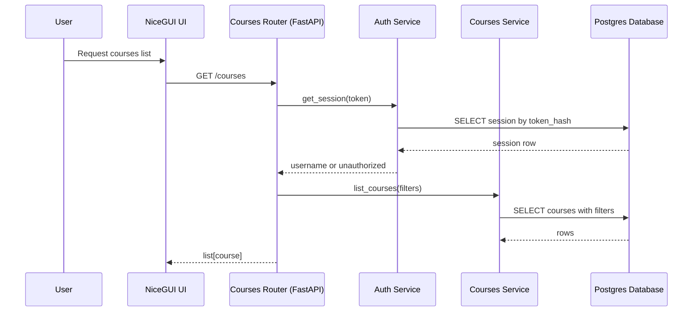

### Courses Domain Overview

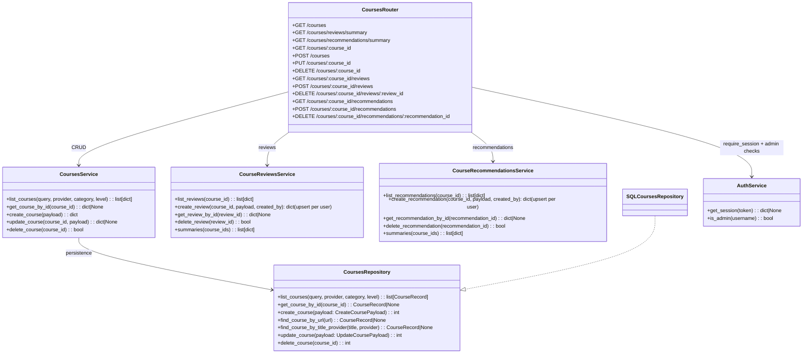

### Courses Data Model

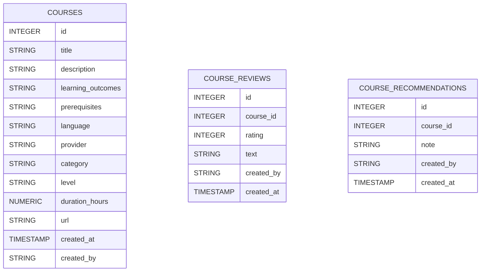

`search_document` is computed in `CoursesService` and returned in API payloads; it is not persisted as a physical database column.

Course review/recommendation write model details:
- `POST /courses/{course_id}/reviews` and `POST /courses/{course_id}/recommendations` are idempotent per user/course pair (create-or-update semantics).
- DB uniqueness is enforced on `(course_id, created_by)` in both `course_reviews` and `course_recommendations`.
- Mutation writes update `created_at` as the latest write timestamp (there is no separate `updated_at` column for these tables).

## Paths Architecture

### Paths Sequence

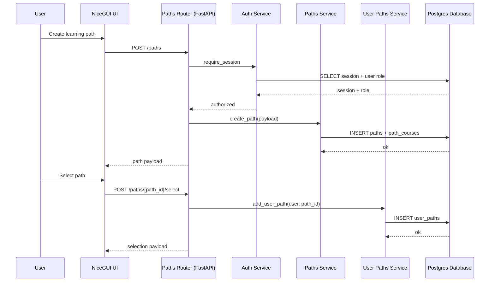

### Paths Domain Overview

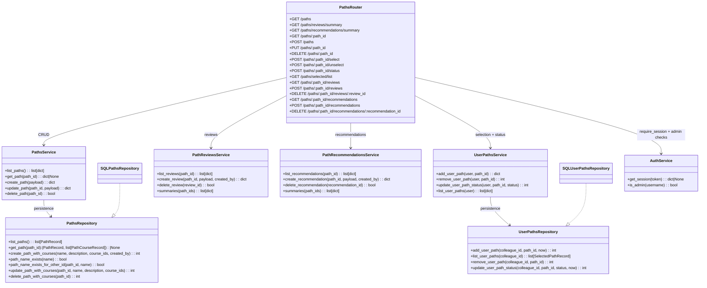

### Paths Data Model

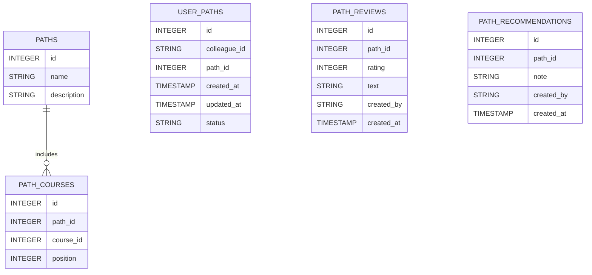

## Tracking Architecture

### Tracking Sequence

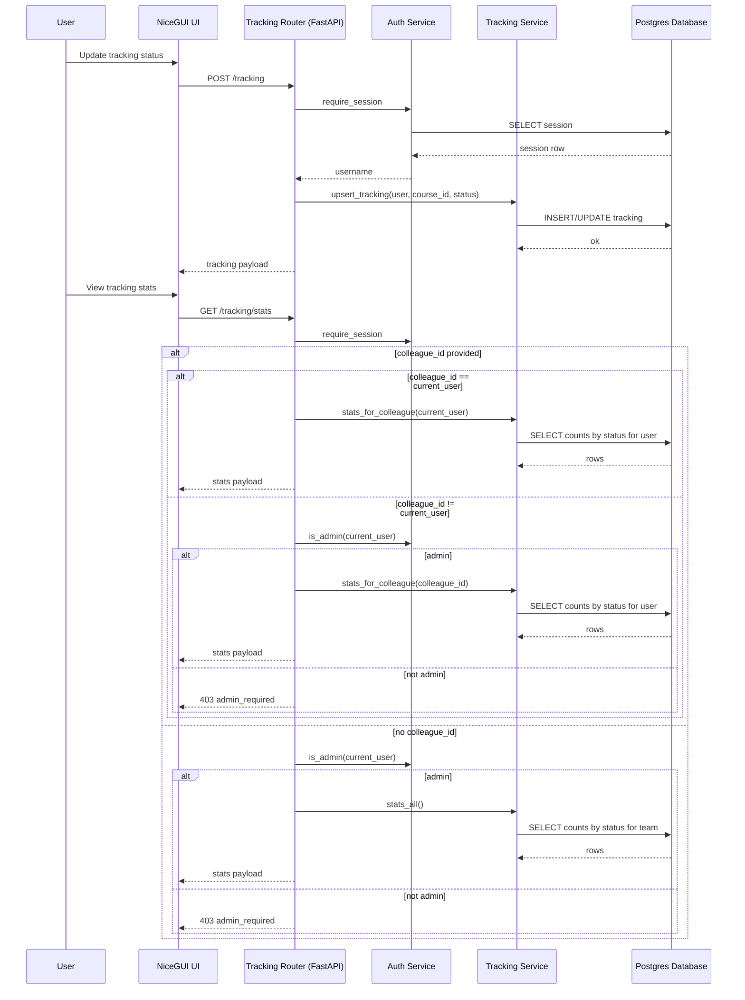

### Tracking Domain Overview

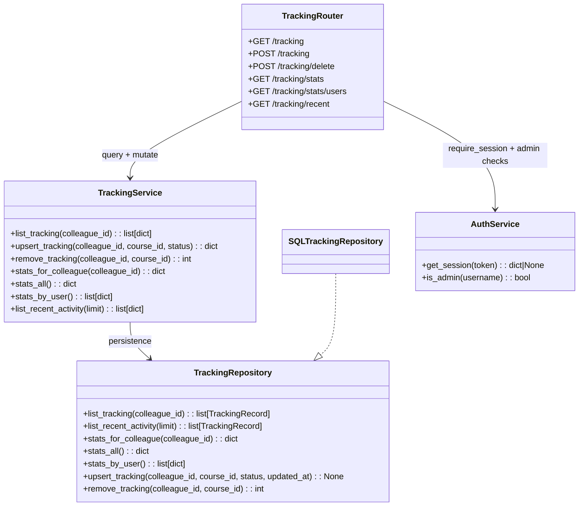

### Tracking Data Model

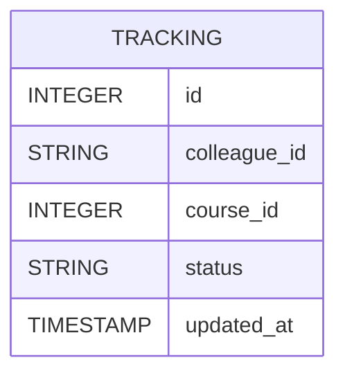

## Articles Architecture

### Articles Endpoints

- `GET /articles`: List/search shared links.
- `POST /articles`: Share a link (authenticated users).
- `GET /articles/reviews/summary`: Review summary rows by article id.
- `GET /articles/{article_id}/reviews`: List article reviews.
- `POST /articles/{article_id}/reviews`: Create/update current user's review.
- `DELETE /articles/{article_id}/reviews/{review_id}`: Delete review (owner/admin).

### Articles Domain Overview

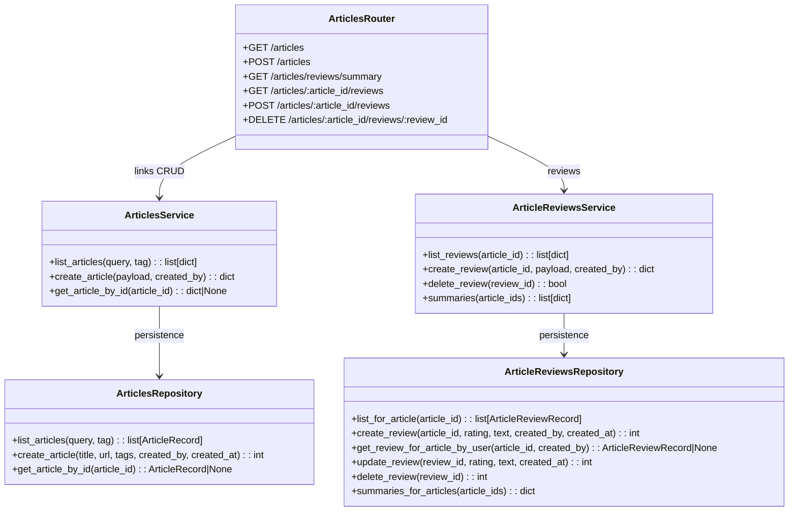

### Articles Data Model

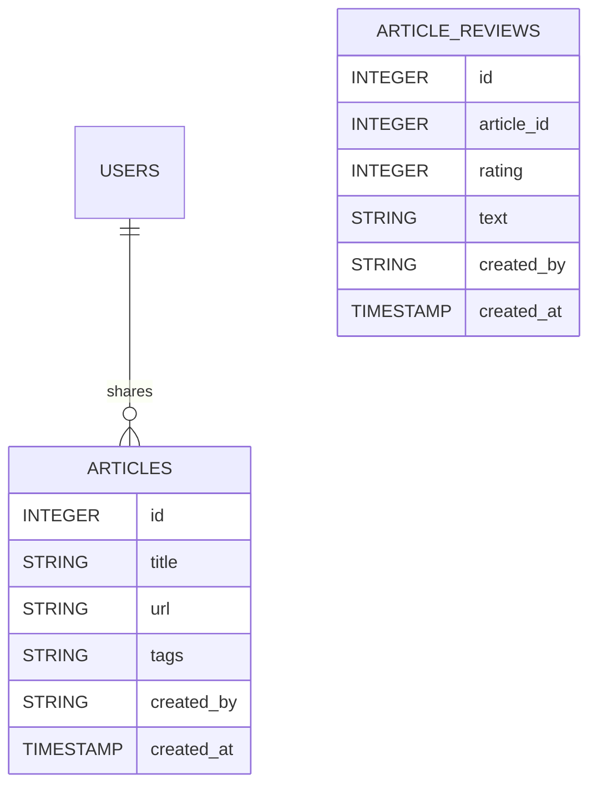

## Videos Architecture

### Videos Endpoints

- `GET /videos`
- `GET /videos/{video_id}`
- `POST /videos`

### Videos Flow Notes

- Router enforces authenticated session.
- Service validates create payloads via typed `_parse_create_payload`.
- Payloads are enriched with best-effort `preview_image_url` resolution through `UrlPreviewService`.
- Videos are first-class learning items, but the current phase intentionally keeps them lighter than courses:
  - no `/tracking` integration
  - no recommendation write model
  - no dedicated reviews API

### Videos Data Model

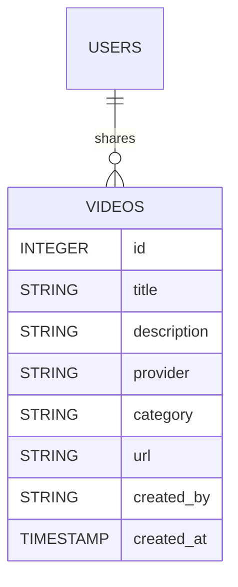

## Notifications Architecture

### Notifications Endpoints

- `GET /notifications/activity?scope=inbox|team&limit=...`

### Notifications Flow Notes

- Router enforces authenticated session.
- Service composes activity from repository reads of:
  - course shares
  - video shares
  - course recommendations
  - path recommendations
  - course reviews
  - path reviews
  - article reviews
- `scope=inbox`: mailbox-style feed for the current user (excludes own events).
- `scope=team`: team-wide timeline feed.
