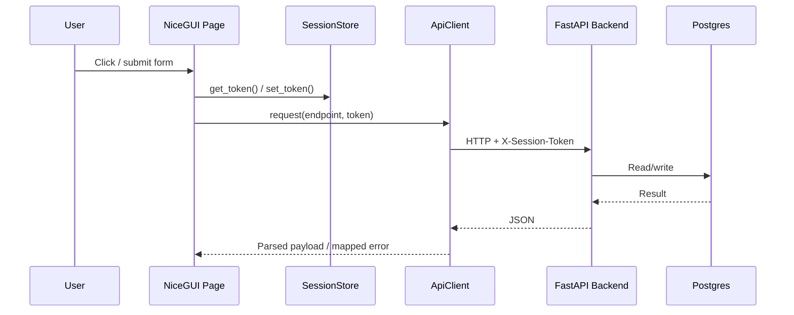
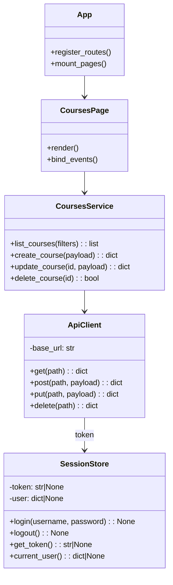

# Frontend Architecture (NiceGUI Target)

## Overview
The current UI is built with Streamlit.
If/when the UI migrates to NiceGUI, a class-based structure fits well because NiceGUI is event-driven and component-oriented.

Recommended separation:

- Pages: route handlers that compose UI and bind events.
- UI components: reusable widgets (tables, forms, dialogs).
- Frontend services: domain-specific “use cases” that orchestrate API calls and UI state updates.
- API client: typed wrapper that handles base URL, `X-Session-Token` injection, and error mapping.
- Session store: single place to manage login state, token persistence, and current-user metadata.

## NiceGUI Sequence

## NiceGUI Domain Overview

Notes:

- Pages should stay thin (UI composition + event handlers).
- Frontend services should contain “workflow logic” (for example refresh lists after mutations).
- `ApiClient` should be the only place that knows about HTTP and error envelopes.
