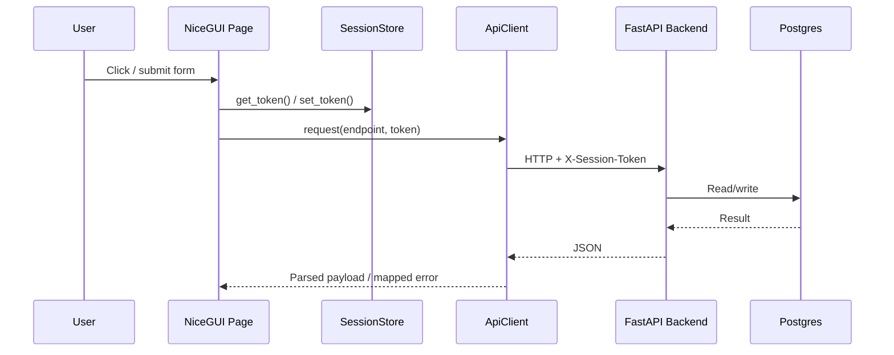
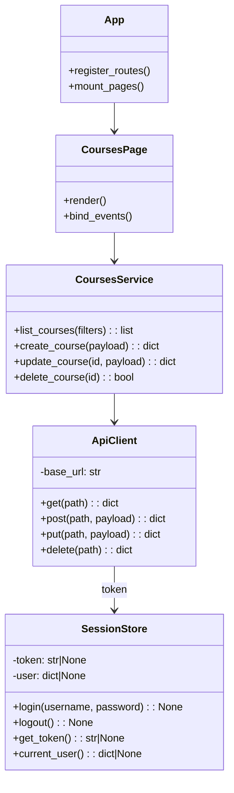
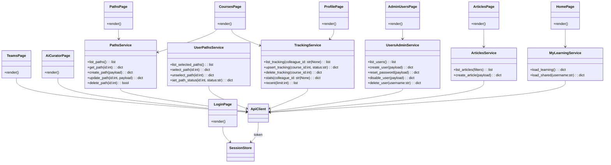

# Frontend Architecture (NiceGUI)

## Overview
The UI is built with NiceGUI.
NiceGUI is event-driven and component-oriented, so a class-based or function-based structure with a dedicated “use-cases/services” layer fits well.

Recommended separation:

- Pages (View): route handlers that compose UI and bind events.
- Page state (Model): typed state objects owned by each page/controller pair.
- Page controllers (Controller): page-level orchestration and mutation flows.
- UI components (View): reusable widgets (tables, forms, dialogs, sections).
- Domain implementation packages: reusable catalog/path/article logic consumed by route pages.
- Frontend services: domain-specific “use cases” used by controllers.
- API client: typed wrapper that handles base URL, `X-Session-Token` injection, and error mapping.
- Session store: single place to manage login state, token persistence, and current-user metadata.

## Lightweight MVC Pattern

We use a lightweight MVC variant for NiceGUI pages:

- Model:
  - Typed page state objects (for example `PathsPageState`).
  - Backend/domain payloads returned by API/services.
- View:
  - Page modules (`frontend/ui/nicegui/pages/<route>/page.py`) for route composition + event binding.
  - Domain section/dialog modules (`frontend/ui/nicegui/domains/<domain>/*.py`) for reusable feature UI.
  - Reusable sections/components (`frontend/ui/nicegui/components/*.py`).
- Controller:
  - Page-specific controller modules (`*_controller.py`) that orchestrate page workflows.
  - Controllers call frontend services and `ApiClient`, but do not render UI.

Rules:

- Keep business/domain rules in backend services.
- Keep frontend controllers focused on UI workflow orchestration.
- Keep page modules thin and avoid large closure/nonlocal state when a typed model can be used.
- Page package `__init__.py` should export `register` only; tests should import helper functions from their source modules.
- Keep dependency direction one-way:
  - `pages/*` may depend on page-local modules, components, core helpers, and services via controllers.
  - `pages/*` may consume `domains/*` implementation modules for shared catalog/detail behavior.
  - `domains/*` must not register routes.
  - `services/*` must not depend on `pages/*` modules.
  - If shared transforms are needed by both page/controller and service, place them in `services/*` (or `core/*`) and import from there.

Reference implementation (current):

- `frontend/ui/nicegui/pages/explore/page.py` (Route composition + bindings)
- `frontend/ui/nicegui/domains/paths/controller.py` (Domain workflow orchestration)
- `frontend/ui/nicegui/domains/paths/state.py` (Model)
- `frontend/ui/nicegui/components/path_card.py`
- `frontend/ui/nicegui/components/path_detail_sections.py`
- `frontend/ui/nicegui/components/paths_sections.py`

## Phase 10D Implementation Notes

The current implementation now standardizes several frontend patterns across pages:

- Shared core helpers:
  - `frontend/ui/nicegui/core/navigation.py`
    - Centralized deep-link and tab URL builders (courses/paths/learning/activity).
  - `frontend/ui/nicegui/core/navigation_intents.py`
    - Unified in-memory + UI-storage intent helpers (`set/get/pop`).
  - `frontend/ui/nicegui/core/mutation_flow.py`
    - Standard optimistic mutation flow (`apply -> refresh -> perform -> rollback on fail -> success hook`).

- Shared UI components:
  - `frontend/ui/nicegui/components/pagination.py`
    - Reusable load-more footer used by list/card pages.
  - Existing section components (`paths_sections`, course/article sections) now host more of the repeated topbar/filter composition.

- Page package structure:
  - `page.py`: UI composition + event binding only.
  - `controller.py`: page orchestration against services/API.
  - `actions.py`: UI callback/handler helpers extracted from nested page closures.
  - `filters.py`: pure filter normalization/query payload shaping.
  - `ui_glue.py`: pure presentation/state glue helpers (meta text, visible-count math, chip descriptors).
  - `state.py` / `view_model.py`: typed mutable state and view projections.

- Performance/caching:
  - `frontend/ui/nicegui/services/courses_service.py`
    - Short-TTL cache for course detail payloads (`/courses/{id}` and reviews).
    - Cache key is scoped (`cache_scope`, `course_id`) to avoid cross-user leakage.
  - Cache invalidation points:
    - Review save/delete in Explore course detail flows.

- Import-cycle guard:
  - `frontend/ui/nicegui/pages/__init__.py` no longer eagerly imports all pages.
  - `frontend/ui/nicegui/pages/ai_curator/__init__.py` uses a lazy `register(...)` proxy.
  - This keeps service-layer tests import-safe when run in isolation.

- Architecture enforcement tests:
  - `tests/frontend/ui/nicegui/test_architecture_docs_contracts.py`
    - Enforces that service modules do not import page modules.
    - Enforces page/controller boundaries and complexity guardrails.
  - `tests/frontend/ui/nicegui/pages/explore/test_explore_architecture.py`
    - Enforces Explore page package UI/pure-module boundaries.

## NiceGUI Sequence

## NiceGUI Domain Overview

Notes:

- Pages should stay thin (UI composition + event handlers).
- Controllers should contain page-flow orchestration (for example refresh lists after mutations).
- Frontend services should contain shared domain use-cases called by controllers.
- `ApiClient` should be the only place that knows about HTTP and error envelopes.

## Pages And Routes

Suggested frontend routes (NiceGUI `ui.page`), aligned to backend domains:

- `/login`: Authenticate and create a session.
- `/`: Redirect to `/home`.
- `/home`: Primary action hub (continue learning + review nudges + personal workspace).
- `/explore`: Unified discovery hub.
- `/explore/courses/{course_id}`: Course detail route.
- `/explore/paths/{path_id}`: Path detail route.
- `/explore/articles/{article_id}`: Article detail route.
- `/share/item`: Canonical learning-item share route (`?type=video|course|article`).
- `/share/path`: Canonical path share route.
- `/teams`: Inbox + team activity feed.
- `/profile`: Profile landing route (redirects to `/profile/stats`).
- `/profile/stats`: Full statistics dashboard.
- `/admin/users`: User management (admin only).

Notes:

- Guard all routes except `/login` behind `require_user(store, api)` (session validation via backend).
- Admin routes additionally check `role == "admin"`.
- Some routes may be feature-flagged via environment variables (see Feature Flags below).
- Canonical product model: a learning item is the primary shareable unit (`video`, `course`, `article` in the current phase), while a path is a separate object composed of learning items.
- Subtype capability model: keep one shared learning-item contract, but do not force feature symmetry. In the released v1 product, `course` supports tracking + reviews, while `article` and `video` support reviews without tracking flows.

## Feature Flags

The UI supports a small set of runtime feature flags (read from environment variables):

- `FEATURE_AI_CURATOR=0|1`: Enables the AI Curator route (`/ai`) and shows/hides it in navigation. Default is `0` for the v1 release.
- `FEATURE_ARTICLES=0|1`: Enables article data in Explore/Home surfaces.

## Page Responsibilities

### LoginPage (`/login`)
Responsibilities:

- Render username/password inputs.
- Call `SessionStore.login(username, password)` and handle errors.
- Redirect to `/` on success.

Backend endpoints:

- `POST /auth/login`
- `GET /auth/me` (optional post-login verification)

### HomePage (`/home`)
Responsibilities:

- Render the primary personal workspace (tracked/selected/shared content).
- Keep "continue learning" and next-action workflows prominent.
- Provide clear transition into discovery (`Explore`) and collaboration (`Teams`).

Backend endpoints (optional):

- `GET /auth/me`
- `GET /tracking`
- `GET /paths/selected/list`
- `GET /courses`
- `GET /paths`
- `GET /articles`

### ExplorePage (`/explore`)
Responsibilities:

- Render unified discovery for courses, paths, and articles.
- Provide share actions for course/path/article creation.
- Provide tracking/select actions and deep-link into detail routes.
- Keep list/detail flows in Explore-local controller/orchestration modules.

Backend endpoints:

- `GET /courses`
- `POST /courses`
- `PUT /courses/{id}` (owner/admin)
- `DELETE /courses/{id}` (owner/admin)
- `GET /paths`
- `GET /paths/{id}`
- `POST /paths`
- `PUT /paths/{id}` (owner/admin)
- `DELETE /paths/{id}` (owner/admin)
- `POST /paths/{id}/select`
- `POST /paths/{id}/unselect`
- `POST /tracking` (for auto-seeding path courses)
- `GET /articles`
- `POST /articles`
- `GET /articles/reviews/summary`
- `GET /articles/{id}/reviews`
- `POST /articles/{id}/reviews`
- `DELETE /articles/{id}/reviews/{review_id}`

### AdminUsersPage (`/admin/users`)
Responsibilities:

- List users.
- Create user.
- Reset password.
- Disable/enable user.
- Delete user.

Backend endpoints:

- `GET /auth/users`
- `POST /auth/users`
- `POST /auth/users/reset`
- `POST /auth/users/disable`
- `DELETE /auth/users/{username}`

### Home Workspace (`/home`)
Responsibilities:

- Provide a single personal overview split into two intents:
- `Learning`: what the user plans to learn (tracked courses + selected paths; optionally saved articles later).
- `Shared`: what the user contributed (courses created by the user, paths created by the user, articles shared by the user).
- Keep this page thin by delegating orchestration to a dedicated service layer.
- Show a "Continue learning" card with the next uncompleted course from selected paths.
- Show review nudges (tracked courses / selected paths without a user review yet).
- Reuse shared card action components for consistent `View` / `Review` actions.

Backend endpoints (current + likely additions):

- `GET /auth/me` (to identify the current user).
- `GET /tracking` or `GET /tracking/list` (self tracking).
- `GET /paths/selected/list` (self selected paths).
- `GET /courses` (filter by `created_by` in the client for now).
- `GET /paths` (filter by `created_by` in the client for now).
- `GET /articles` (filter by `created_by` in the client for now).

Notes:

- For scale/performance, prefer adding server-side filters:
- `GET /courses?created_by=alice`
- `GET /paths?created_by=alice`
- `GET /articles?created_by=alice`

### TeamsPage (`/teams`)
Responsibilities:

- Show inbox/team activity feed for collaboration updates.
- Allow tab-based filtering between personal inbox and team timeline.
- Route activity targets to course/path/article detail pages.

Backend endpoints:

- `GET /notifications/activity`

### ProfilePage (`/profile`, `/profile/stats`)
Responsibilities:

- Redirect `/profile` to `/profile/stats`.
- Show detailed user stats and (for admins) team stats breakdown.
- Keep snapshot stats discoverable from Home while full breakdown stays in Profile.

Backend endpoints:

- `GET /tracking/stats`
- `GET /tracking/stats/users`

## Expanded Domain Model

## Error Handling And UX

Recommended approach:

- `ApiClient` raises a typed exception (for example `ApiError(status_code, message, timestamp)`).
- Pages catch `ApiError` and render a consistent toast/dialog.
- Treat `401` as "session expired": clear token in `SessionStore` and redirect to `/login`.

This keeps errors consistent across all pages.
