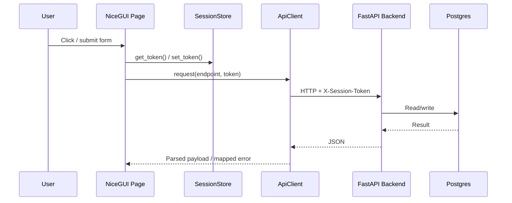
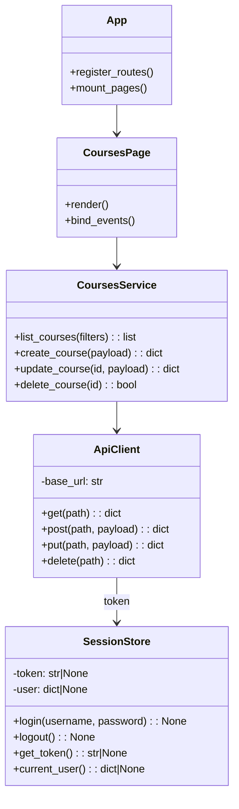
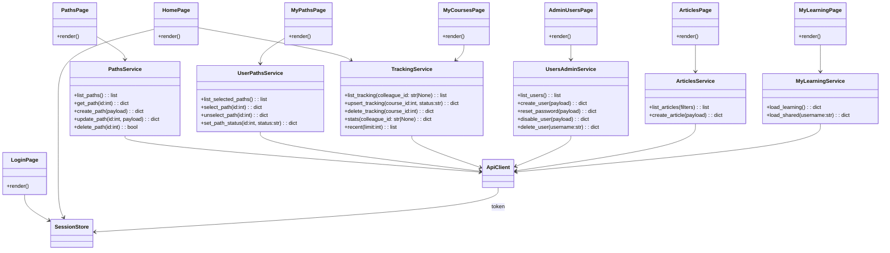

# Frontend Architecture (NiceGUI)

## Overview
The UI is built with NiceGUI.
NiceGUI is event-driven and component-oriented, so a class-based or function-based structure with a dedicated “use-cases/services” layer fits well.

Recommended separation:

- Pages: route handlers that compose UI and bind events.
- UI components: reusable widgets (tables, forms, dialogs).
- Frontend services: domain-specific “use cases” that orchestrate API calls and UI state updates.
- API client: typed wrapper that handles base URL, `X-Session-Token` injection, and error mapping.
- Session store: single place to manage login state, token persistence, and current-user metadata.

## NiceGUI Sequence

## NiceGUI Domain Overview

Notes:

- Pages should stay thin (UI composition + event handlers).
- Frontend services should contain “workflow logic” (for example refresh lists after mutations).
- `ApiClient` should be the only place that knows about HTTP and error envelopes.

## Pages And Routes

Suggested frontend routes (NiceGUI `ui.page`), aligned to backend domains:

- `/login`: Authenticate and create a session.
- `/`: Home/Dashboard (personal overview + quick links).
- `/courses`: Browse/search courses.
- `/courses/my`: Personal course tracking ("My Courses").
- `/paths`: Browse learning paths.
- `/paths/my`: Selected paths and progress ("My Paths").
- `/articles`: Share and browse colleague-submitted links ("Articles").
- `/me`: Personal overview across domains ("My learning").
- `/admin/users`: User management (admin only).

Notes:

- Guard all routes except `/login` behind `SessionStore.current_user()`.
- Admin routes additionally check `role == "admin"`.
- Some routes may be feature-flagged via environment variables (see Feature Flags below).

## Feature Flags

The UI supports a small set of runtime feature flags (read from environment variables):

- `FEATURE_AI_CURATOR=0|1`: Enables the AI Curator route (`/ai`) and shows/hides it in navigation.
- `FEATURE_ARTICLES=0|1`: Enables the Articles route (`/articles`) and shows/hides it in navigation.

## Page Responsibilities

### LoginPage (`/login`)
Responsibilities:

- Render username/password inputs.
- Call `SessionStore.login(username, password)` and handle errors.
- Redirect to `/` on success.

Backend endpoints:

- `POST /auth/login`
- `GET /auth/me` (optional post-login verification)

### HomePage (`/`)
Responsibilities:

- Render current user and role.
- Show quick links to Courses, Paths, and Tracking.
- Optionally show recent team activity for admins.

Backend endpoints (optional):

- `GET /auth/me`
- `GET /tracking/recent` (admin)

### CoursesPage (`/courses`)
Responsibilities:

- Render filters (query/provider/category/level).
- Call `CoursesService.list_courses(...)`.
- Create courses (any authenticated user).
- Edit/delete courses only when the current user is the creator (or an admin).

Backend endpoints:

- `GET /courses`
- `POST /courses`
- `PUT /courses/{id}` (owner/admin)
- `DELETE /courses/{id}` (owner/admin)

### MyCoursesPage (`/courses/my`)
Responsibilities:

- Render personal tracking table (course + status).
- Update a course status with inline controls.
- Remove tracking entries.

Backend endpoints:

- `GET /tracking` (self)
- `POST /tracking`
- `POST /tracking/delete`

### PathsPage (`/paths`)
Responsibilities:

- Render all paths (name, description).
- Open path detail view (courses ordered).
- Track/untrack paths (binary state only).
- On track: auto-seed untracked path courses as `interested`.
- Create paths (any authenticated user).
- Edit/delete paths only when the current user is the creator (or an admin).

Backend endpoints:

- `GET /paths`
- `GET /paths/{id}`
- `POST /paths`
- `PUT /paths/{id}` (owner/admin)
- `DELETE /paths/{id}` (owner/admin)
- `POST /paths/{id}/select`
- `POST /paths/{id}/unselect`
- `POST /tracking` (for auto-seeding path courses)

### MyPathsPage (`/paths/my`)
Responsibilities:

- Deprecated: merged into `/paths` + `My learning`.

Backend endpoints:

- Deprecated for direct page usage.

### AdminUsersPage (`/admin/users`)
Responsibilities:

- List users.
- Create user.
- Reset password.
- Disable/enable user.
- Delete user.

Backend endpoints:

- `GET /auth/users`
- `POST /auth/users`
- `POST /auth/users/reset`
- `POST /auth/users/disable`
- `DELETE /auth/users/{username}`

### ArticlesPage (`/articles`)
Responsibilities:

- Allow colleagues to share links (title, URL, optional tags).
- Browse/search shared links.

Backend endpoints:

- `GET /articles`
- `POST /articles`

### MyLearningPage (`/me`)
Responsibilities:

- Provide a single personal overview split into two intents:
- `Learning`: what the user plans to learn (tracked courses + selected paths; optionally saved articles later).
- `Shared`: what the user contributed (courses created by the user, paths created by the user, articles shared by the user).
- Keep this page thin by delegating orchestration to a dedicated service layer.

Backend endpoints (current + likely additions):

- `GET /auth/me` (to identify the current user).
- `GET /tracking` or `GET /tracking/list` (self tracking).
- `GET /paths/selected/list` (self selected paths).
- `GET /courses` (filter by `created_by` in the client for now).
- `GET /paths` (filter by `created_by` in the client for now).
- `GET /articles` (filter by `created_by` in the client for now).

Notes:

- For scale/performance, prefer adding server-side filters:
- `GET /courses?created_by=alice`
- `GET /paths?created_by=alice`
- `GET /articles?created_by=alice`

## Expanded Domain Model

## Error Handling And UX

Recommended approach:

- `ApiClient` raises a typed exception (for example `ApiError(status_code, message, timestamp)`).
- Pages catch `ApiError` and render a consistent toast/dialog.
- Treat `401` as "session expired": clear token in `SessionStore` and redirect to `/login`.

This keeps errors consistent across all pages.
