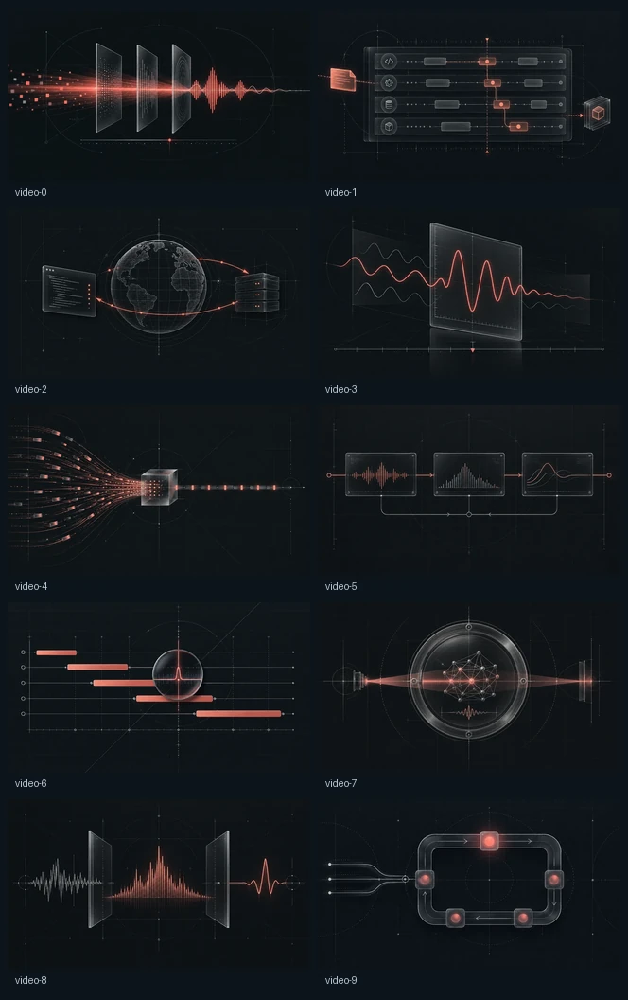
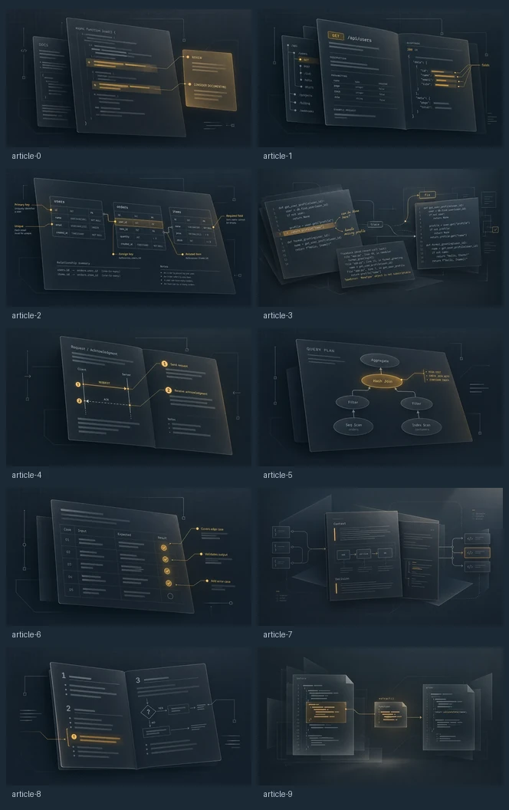
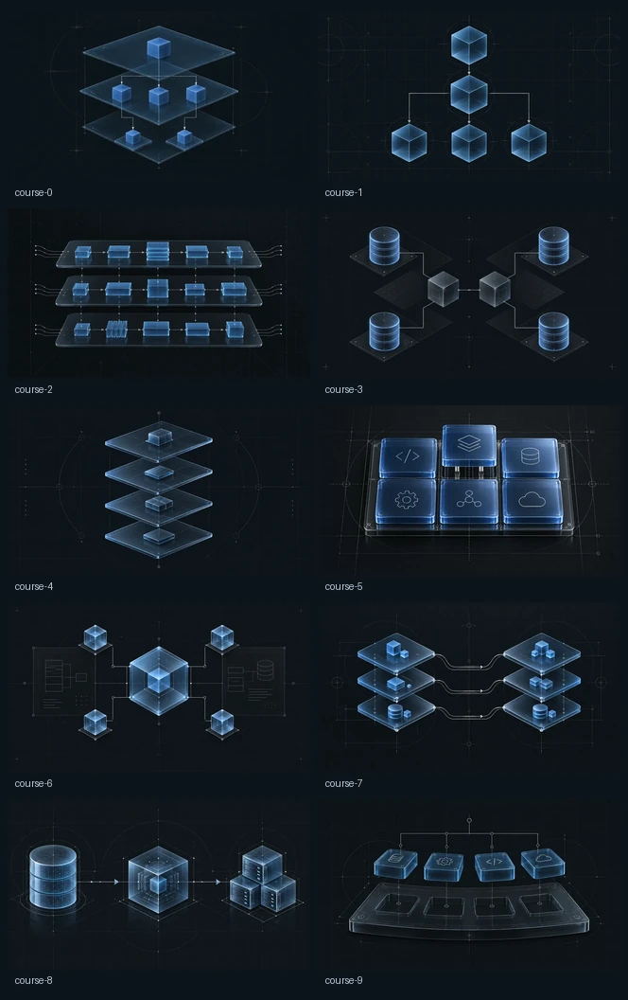
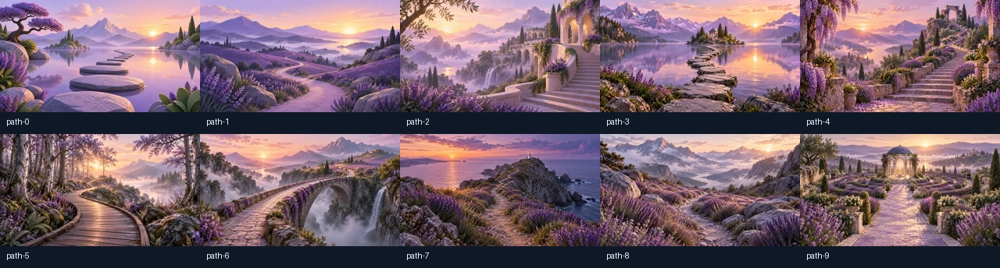

# Developer technical editorial artwork

Upstream uses **40 covers: ten each for videos, articles, courses, and paths**. The collection follows a technical publication and architecture diagram style: **55% diagram, 25% editorial composition, 20% dimensionality**. Lighter slate backgrounds, silver construction lines, layered graphite surfaces, softly lit edges, and restrained format accents keep diagrams readable.

Every format uses the same drafting brief: slate `#1c2935`, a faint square grid, fine silver strokes, quiet secondary lines, subtle illumination at focal points, and minimal visual noise. Views are orthographic or restrained isometric. Courses use shallow software service modules and schemas; articles use flatter code and documentation surfaces. Videos depict runtime behavior and paths use Git progression. Physical hardware, machinery, and generic engineering subjects are excluded. Vary the main silhouette, arrangement, and direction within each format while keeping this shared visual language.

| Format | Metaphor | Visual language |
| --- | --- | --- |
| Video | See it run. | Coral execution traces, debugging, packets, request/response flows |
| Article | Understand the idea. | Amber annotations, code reviews, documentation layers, references |
| Course | Build the system. | Blue service modules, software stacks, schemas, dependencies |
| Path | Follow the progression. | Violet branches, milestones, routes, state transitions |

## Format recognition and subject variety

Each format has a dominant structure: articles explain through documentation and annotations; videos depict execution over time; courses assemble connected systems; paths follow milestones, branches and states. Color reinforces these structures rather than supplying the only distinction.

| Format | Example variants | Subjects |
| --- | --- | --- |
| Article | 1, 2, 4, 5, 6, 8 | API reference, schema explanation, protocol documentation, query plan, test specification, runbook |
| Course | 1, 3, 5, 6, 7, 8 | Event-driven system, databases, component assembly, identity architecture, storage, distributed network |
| Video | 2, 4, 5, 8 | Packet transit, streaming buffer, test execution, rendering frames |
| Path | 2, 5, 7, 9 | Learning milestones, debugging states, prerequisite graph, merge tree |

Keep code-panel-led compositions to at most three per format. Use short labels, meaningful annotations and sparse supporting code only. Avoid framing every element in a floating panel. Documentation pages remain appropriate for articles. Keep important subjects within the central 65% of image height and 85% of width. Review silhouettes without badges and in grayscale as well as at card size and banner crops.

## Review the full collection

Each sheet shows variants 0–9 in reading order. All variants, including the four signature illustrations, use the approved balanced editorial treatment.

### Videos

### Articles

### Courses

### Paths

## Assignment and delivery

`ResourceArtwork` selects a stable variant from the content type and normalized title. The existing title fingerprint compatibility map preserves established variant assignments. The same resource receives the same cover across cards, spotlights, previews, and detail pages. Titles and metadata remain accessible HTML; artwork is decorative and does not claim to depict a resource's exact contents.

All 80 responsive assets are saved in `frontend/react/public/artwork/`: `{type}-{0..9}.webp` at 1280×720 and `{type}-{0..9}-card.webp` at 640×360. Each full image stays below 200 KB and each card below 60 KB. Image URLs include `?v=refined-1` for cache invalidation. Lazy loading, responsive sources, reserved dimensions, and local failure recovery are supported. The four `-technical` signature assets remain available as aliases of variant 0 and match variant 0.

## Generation

The covers were generated with the built-in image tool, using [approved style references](balanced-preview/README.md). [Final prompts and source records](generation-record.json) identify all forty selected outputs. Source records store portable PNG filenames only, without machine-specific paths. Re-export with `python docs/artwork/export_technical.py --source-dir <generated-images-directory>` (requires Pillow and the original generated PNG files). The source directory is supplied at runtime and is never written to the records. Export only resizes and encodes the generated artwork and assembles review sheets. No generation occurs at runtime.

The illustration files are bundled locally; no database or content changes are required.

## Verification

When changing covers, inspect the full collection together for subject variety, consistent lighting and format identity. Review 320×180 cards, wide banners and narrow mobile crops. Check silhouettes without badges and in grayscale; essential shapes should remain recognizable without small labels.

Verify ten variants per format, 1280×720 and 640×360 exports, full images below 200 KB and cards below 60 KB. Keep variant-0 signature aliases synchronized. Check portable source filenames and all repository style-reference links. Re-exporting requires the original generated PNGs; those source files are supplied separately at runtime.

Run frontend checks and the [pinned Linux visual workflow](../operations.md#visual-regression-checks) after changing shipped artwork. Review changed baselines before accepting them. Use mocked visual data rather than a working application database.
