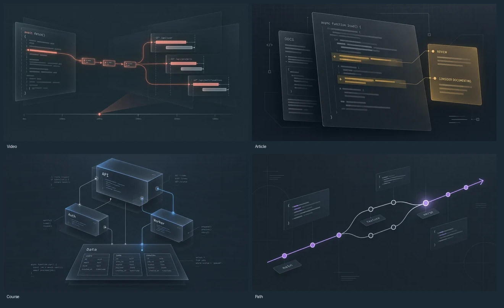

# Balanced editorial samples

Four candidate covers explore a middle ground: 55% software diagram, 25% editorial composition, 20% dimensionality. Slate backgrounds and quiet drafting lines support softly lit edges and selectively layered graphite surfaces.

These are the approved direction samples. The full collection now follows this style; the course signature was recomposed horizontally for banner crops. See the [active collection](../README.md).

| Format | Software subject | Asset |
| --- | --- | --- |
| Course | API, authentication, worker dependencies and data schemas | [Course](course.webp) |
| Article | Annotated code review and documentation | [Article](article.webp) |
| Video | Code execution, network requests and response timing | [Video](video.webp) |
| Path | Git commits, feature branches and merges | [Path](path.webp) |

## In the app

The real Explore page was rendered with mocked API data and browser-only artwork substitutions at desktop and mobile sizes. No application data or production artwork mapping was changed. Both browser checks passed. The sample descriptions are existing visual-test fixtures, not claims that the artwork depicts those resources exactly.

- [Desktop preview](app-1440.png)
- [Mobile preview](app-390.png)

## Sources

Generated with the built-in image generation tool, one call per cover. [Prompts and portable source filenames](generation-record.json). Each cover has a 1280×720 WebP and a 640×360 card export; all fit the existing 200 KB / 60 KB budgets. Export processing only resized and encoded the generated images and assembled the review sheet.
