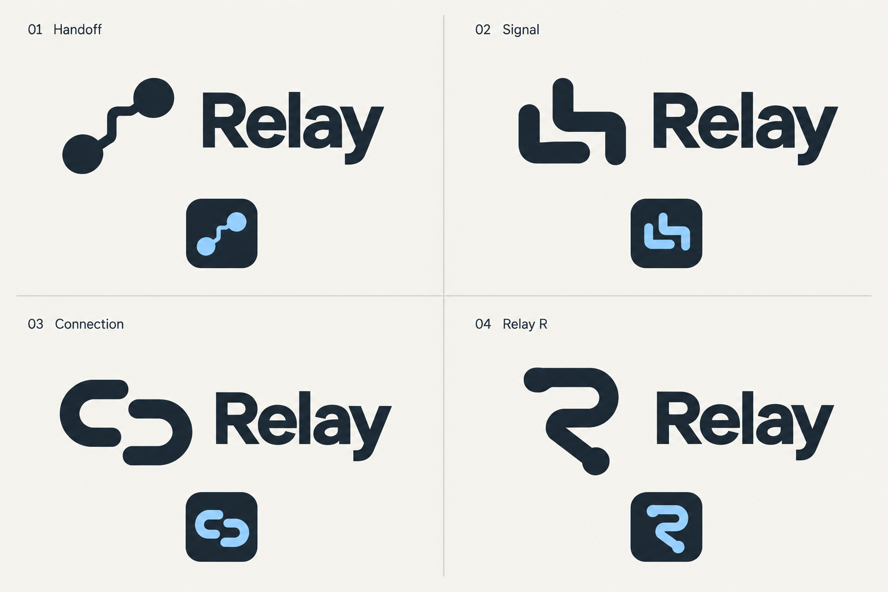

# Upstream identity

The approved reference is [Simple Flow](upstream-simple-flow.png). Production SVGs use two flowing shapes and a negative-space channel without a background circle. They were rebuilt directly as vectors; the raster mockup is not shipped in the app.

## Production usage

Assets live in [the public branding directory](../../frontend/react/public/branding/). `upstream-mark.svg` uses blue `#0879C4` to mint `#79E6C4`; `upstream-mark-mono.svg` uses identical geometry in slate `#142B3A`. When embedded inline, its `currentColor` fill supports a light monochrome treatment.

The shared React Brand component pairs the decorative mark with live Space Grotesk text. Navigation uses a 32px mark, login a 44px mark. Only login displays “Share what you learn.” Icon-only home links are labelled “Upstream home”. Content-type book icons are independent of the brand.

`favicon.svg` uses a solid mint mark on a rounded slate tile. `favicon.ico` contains 16px and 32px versions. `upstream-app-icon.svg` supplies the gradient artwork for the 180px `apple-touch-icon.png`; its square background lets the operating system apply its own mask. Raster icons are Chromium renders of the SVG sources, with Pillow encoding the ICO sizes.

## Historical explorations

### Relay icon directions

Exploratory mockups for Relay's app symbol and wordmark. Generated with the built-in image tool; these are review concepts, not production vector assets.

1. **Handoff:** two endpoints connected by a stepped route; emphasizes knowledge passing between people.
2. **Signal:** paired rounded strokes; compact and abstract.
3. **Connection:** opposing open links; emphasizes exchange.
4. **Relay R:** a route-shaped lettermark; ties the symbol directly to the name.

These Relay directions are historical explorations, superseded by Upstream Simple Flow.

[Generation and corrective-edit prompts](generation-record.json) use portable source filenames. Earlier artwork and UI mockups retain their original branding as historical design references.
